# 注释1：格雷西家族

格雷西家族是源于巴西的格斗家族，以创立巴西柔术（又称格雷西柔术）著称。

格雷西家族通过参与无限制格斗赛事改良技术，并借助UFC赛事推广柔术。家族成员曾通过“格雷西挑战”与不同背景的选手进行无限制格斗并获胜，以此建立声誉。

20世纪初，日本柔术家前田光世在巴西进行柔术演示和表演赛，推动了该运动在巴西的普及，他定居贝伦并教授柔术。前田光世的师傅是日本现代柔道创始人嘉纳治五郎。而卡洛斯·格雷西是前田光世的学生之一，后与其弟海利奥·格雷西改良技术。海利奥·格雷西身体瘦弱，但在钻研过程中，发展出了许多以小胜大的战术，完成了从“日本柔术”到“巴西柔术”的演化。

然而，现在提到这个词，很多日本人的第一反应不是巴西柔术本身，而是“这个家族人数特别多、个个都很能打、并且名字很难分得清”的刻板印象。在鼎盛时期，日本媒体经常报道：「またグレイシーか（怎么又是格雷西家的人）」，逐渐形成了“格雷西一族 = 人多得离谱的武术名门”的刻板印象。

# 注释2：ARENA

在日本，「アリーナ（Arena）」一般属于中大型演唱会场地，通常仅次于ドーム（巨蛋）和スタジアム（体育场）。部分场地的容量如下：

横浜アリーナ：约12,000～17,000人

有明アリーナ：约10,000～15,000人

Kアリーナ横浜：约20,000人

其中，2023年新开业的“Kアリーナ横浜”为日本目前最大的音乐专用Arena之一，也是《BanG Dream!》企划10周年LIVE「In the name of BanG Dream!」的举办地。图中展示的场地即为本次LIVE的全景图。

# 注释3：歌舞伎和落语家的袭名传承

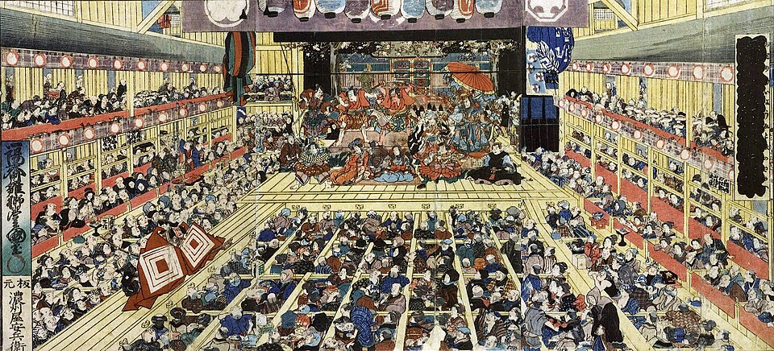

歌舞伎（かぶき）是一种高度程式化的日本传统戏剧。演员在舞台上用夸张的表演、台词、音乐、舞蹈和服装，将故事表演出来。与其所借鉴的中国传统戏曲类似，它和现代电视剧、写实话剧最大的区别之一，在于其并不追求“像现实生活一样自然”，而是有一套非常成熟的舞台语言，通过夸张的肢体动作来增强戏剧的表现力；且同样由男性演员出演所有角色，并用脸部妆容的颜色区别人物的性格等属性。

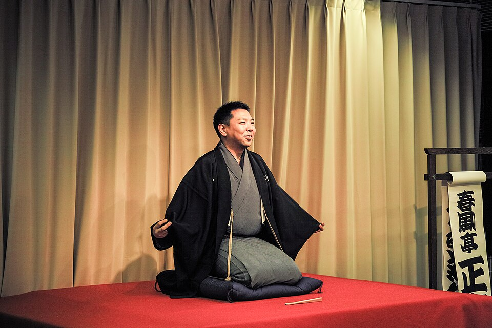

落語（らくご）是日本的一种传统单口说笑/讲故事表演艺术。中文有时译作“落语”“日式单口相声”，但严格来说和中国相声并不完全一样。落语家通常一个人坐在舞台上，只用：扇子、手巾、语言和神态来扮演故事中的不同人物，通过改变声音、视线和身体朝向，让观众分辨出不同角色。传统落语故事最后通常会有一个オチ（落ち），通过前期讲故事的环节不断铺垫，最后用一句出乎意料且带有笑点的话“甩掉包袱”，进行整个落语的收尾。

袭名（しゅうめい）则指的是日本传统艺术界的一种继承并正式使用前辈的艺名的制度。艺人可能先使用一个较年轻的名号，经过多年修业后，在某个阶段会举行盛大的“袭名披露”，宣布继承父亲或师傅使用的艺名。

# 注释4：黑杰克（21点）

纸牌游戏21点（Blackjack）的玩法如下：玩家和庄家各自拿牌，目标是让手牌的点数和尽可能接近21点，点数和更大的一方获胜，但只要点数大于21便立刻失败。

在该游戏中，2～10的点数按照牌面点数计算，J、Q、K的点数按10计算，而A的点数既可以视为1，也可以视为11，按照对玩家有利的方式计算。

一般来说，在玩家手牌点数和较小时，可以大胆摸牌；但如果点数和较大，则需要在摸牌前考虑爆牌失败的风险。

# 餐品注释1：炸猪排套餐

「トンカツ定食」（炸猪排套餐）是日本经典的套餐之一，也是许多专门店（とんかつ屋）的招牌菜。

一份标准的炸猪排套餐通常包括：作为主菜的炸猪排、白米饭、味噌汤、高丽菜丝、腌菜，有时还会有少量土豆沙拉、小菜等。

猪肉通常是猪里脊或猪腰内肉，裹上面粉、蛋液、面包糠并油炸至金黄色。吃的时候通常蘸猪排酱、芥末、芝麻等。

# 餐品注释2：冬阴功咖喱

「トムヤムカレー」（Tom Yum Curry，冬阴功咖喱）是一种将泰国冬阴功（Tom Yum）和咖喱结合起来的融合料理。它并不是泰国传统菜，而是在日本比较常见的一种创意咖喱（創作カレー）。通常会以咖喱饭的形式出现，包含：米饭、偏稀的咖喱酱、鸡肉、虾、蘑菇等配料。本作中的做法中还加入了大量的香菜。与普通日式咖喱相比，它具有明显的冬阴功风味。吃起来通常会有酸辣、香料感很强、比日式咖喱清爽、带有东南亚风味等感觉。

尽管本作中的冬阴功咖喱采用的是正宗泰国做法，但现实中的日本人看到「トムヤムカレー」时，通常会理解为「具有冬阴功风味的咖喱（冬阴功咖喱饭）」，而不是一种历史悠久、固定做法的传统泰国料理。不同店家的配方差异可能很大，有的更接近冬阴功汤，有的则更像日式咖喱，只是加入了冬阴功的香料和酸辣风味。

# 餐品注释3：方盒鳗鱼饭

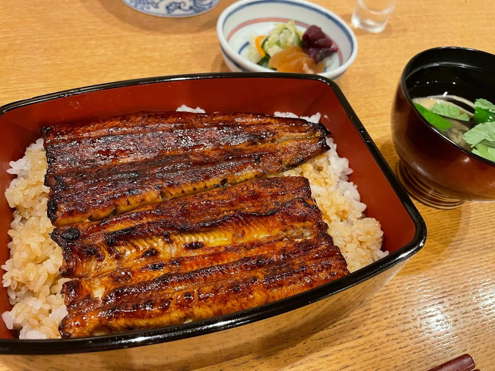

虽然音无因为失忆，没有认出来这道菜具体是哪种鳗鱼饭，但根据成就列表和Key开发团队留下的注释推断，日向掏出来的这道菜实际是相当高级的方盒鳗鱼饭。

「うな重」（方盒鳗鱼饭）是鳗鱼饭中的一种，全称是：鰻の重箱（装在重箱里的鳗鱼）。通常是蒲烧鳗鱼+白饭+鳗鱼酱汁的组合，装在漆器方盒（重箱）里。和其他的鳗鱼饭在食材上并没有主要区别，主要通过容器和风格体现高级感。

# 餐品注释4：味噌猪排盖饭

「味噌カツ丼」（味噌猪排盖饭）是日本中部地区，尤其是爱知县名古屋最具代表性的盖饭之一。和普通炸猪排盖饭的区别在于其特有的的名古屋风赤味噌酱汁。

其中的味噌用的不是一般的白味噌，而是八丁味噌（はっちょうみそ）或类似的赤味噌（红味噌）。这种味噌咸鲜味很浓，且发酵香气明显，常加入糖、味醂、酒熬成酱，因此整体呈现咸甜浓郁的风味，颜色接近巧克力酱或黑糖浆的深红褐颜色。

# 餐品注释5：芝士焗饭

「ドリア」（芝士焗饭）是日式西餐的一种。通常以米饭为底，中间加上鸡肉、海鲜、蘑菇等配料，浇上酱汁（最常见是奶油白酱）并铺满芝士，放进烤箱烤至表面金黄。最终呈现出表面焦黄且带有拉丝芝士、中间浓郁顺滑的口感。

虽然名字很像意大利菜，但ドリア实际上是在日本诞生的洋食。相传20世纪初，日本横滨一家西餐厅的主厨为客人创作了这道菜：将米饭、奶油白酱和奶酪一起焗烤，后来逐渐流行全国。尽管名字源于西方，且国内外卖餐厅也经常出现这道菜，但ドリア在欧美并没有与之完全对应的传统菜肴。

# 餐品注释6：法式巧克力长条泡芙

「éclair」（法式巧克力长条泡芙）是一种源自法国的西式点心，日语直接音译为エクレア。法语词 éclair 的本意即为【闪电/雷电/一道电光】，后来成为该甜点的名称。

关于名称的来源，目前有几种说法，但没有一种能够百分之百确定。最广为流传的说法是：长条形状拿起来就能吃，且奶油含量较高导致放久了容易塌，所以吃得像闪电一样快。

# 餐品注释7：盐味拉面

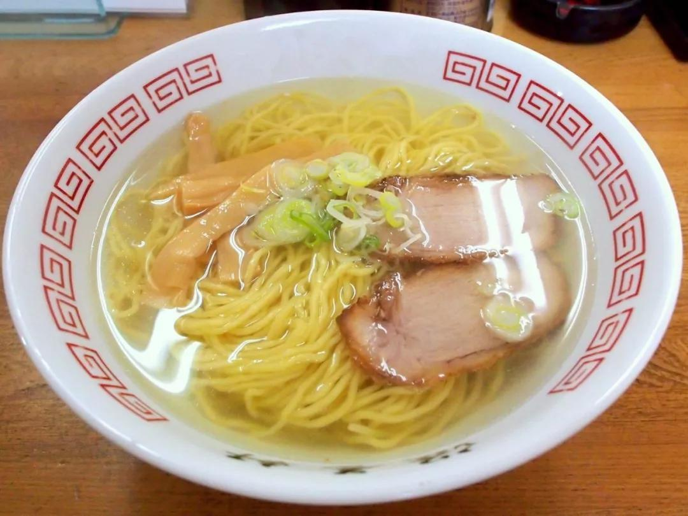

「塩ラーメン」（盐味拉面），是日本拉面的四大经典口味之一（另外三种一般是酱油拉面、味噌拉面、猪骨拉面）。这种拉面以盐作为主要调味料，突出高汤本身的鲜味。面汤一般呈颜色透明或淡金色，是四种口味中最清澈的一种。盐一般不是直接加入面汤，而是调配成一种名为“盐汁”的调味料，除了盐还可能加入：海盐或岩盐、清酒、昆布提取物、贝类浓缩汁、鸡油、香味油。

# 餐品注释8：酱油拉面

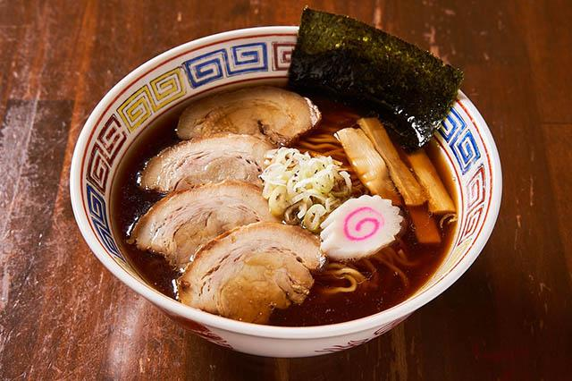

「酱油ラーメン」（酱油拉面）相比盐味拉面，更强调高汤与酱油香气的平衡。面汤一般呈琥珀色到深褐色。酱油通常不是直接倒进汤里，而是事先调配好的酱汁，除酱油外还可能包含味醂、清酒、糖、昆布提取物、干贝或海鲜提鲜、动物油脂等。

# 餐品注释9：南蛮炸鸡套餐

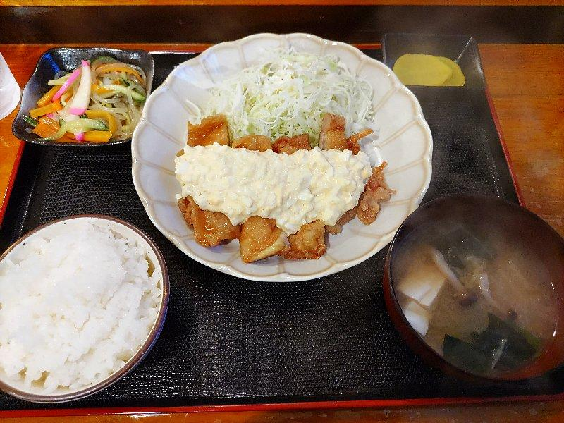

「チキン南蛮定食」（南蛮炸鸡套餐）是日本非常受欢迎的一种套餐（定食），是宫崎县的代表性乡土料理。通常先将鸡腿肉或者鸡胸肉裹粉后油炸至金黄，然后趁热浸入酸甜口的南蛮醋（通常以醋、酱油、糖等调制），最后淋上大量的塔塔酱。整体属于酸甜＋浓郁＋酥脆的组合。

“南蛮”的语源并不是指某种香料，也不是指被诸葛亮七擒七纵的孟获。日本战国至江户初期把从葡萄牙、西班牙等地传入的事物称为南蛮。当时传入了使用醋进行调味的料理，后来演变出「南蛮漬け」「チキン南蛮」等名称。

# 餐品注释10：卷面

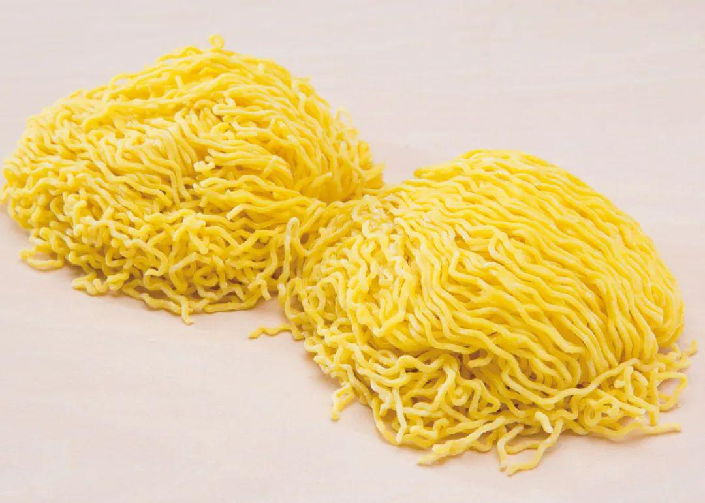

「縮れ麺」（卷面）指的是表面呈波浪状弯曲的拉面面条。通过在切面刀上安装橡胶垫来制成。相比直面更容易挂上更多汤汁，且更具有弹性。

# 餐品注释11：玛格丽特披萨

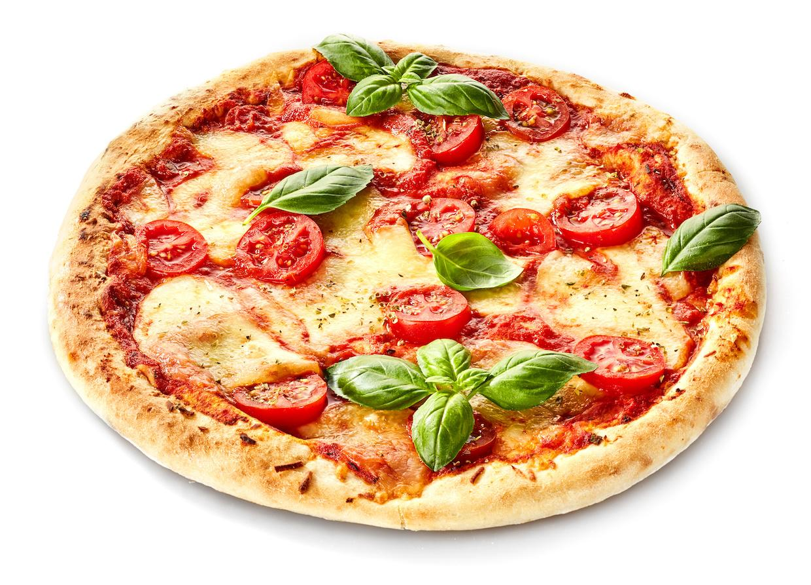

「Margherita pizza」（玛格丽特披萨）是一种非常经典的意大利披萨。与肉类或水果较多的美式披萨不同，这种披萨的面饼上通常只有番茄酱、马苏里拉奶酪、罗勒叶、橄榄油等基础配料。

关于名称的来源，有说法是19世纪末，披萨师傅制作了这种意大利国旗配色的披萨，献给了意大利的玛格丽塔王后（Margherita di Savoia），因此得名。但关于这个故事的真实性，历史学界有一些争议。

# 餐品注释12：火腿热狗

「ハムドッグ」（火腿热狗）在日本通常指夹着火腿肉的热狗形长面包。需要注意的是，日本的“XX热狗”往往只是长条面包里夹着对应的馅料，并不包含美式热狗原有的香肠。

# 餐品注释13：炸牡蛎套餐

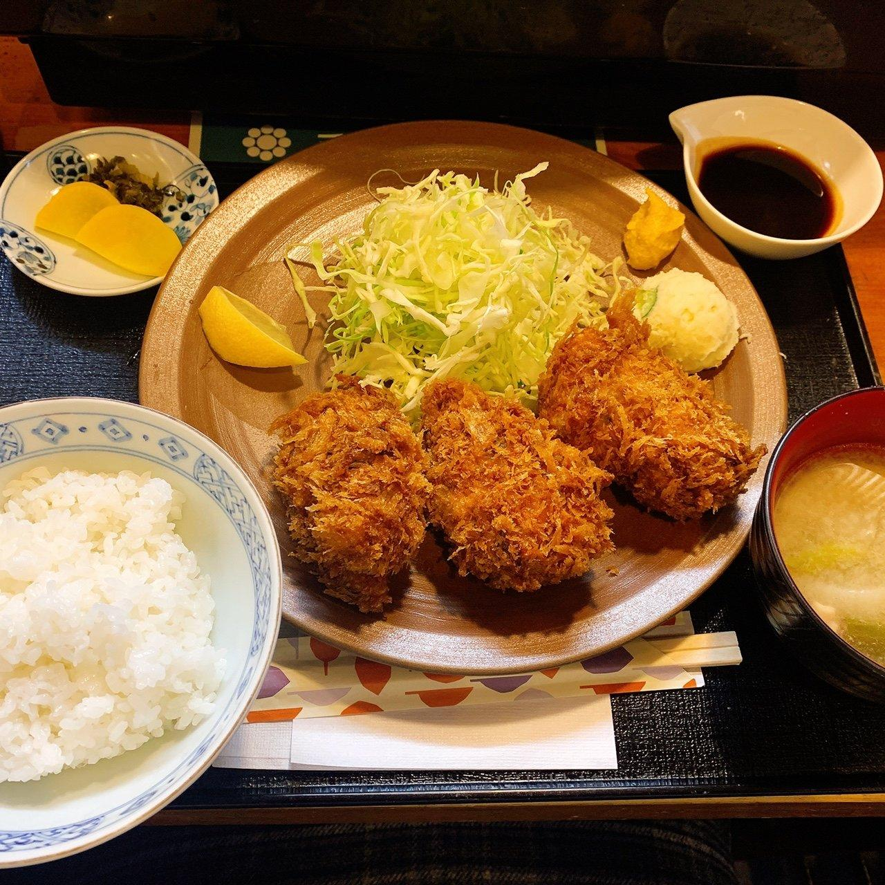

「牡蠣フライ定食」（炸牡蛎套餐）通常将牡蛎裹上面粉、鸡蛋液、面包糠后进行油炸。其外层酥脆，里面的牡蛎则是柔软、多汁、带有明显海鲜鲜味。如果牡蛎比较肥，咬开时里面会有很多汁水。通常还会搭配塔塔酱或其他酱汁。

# 餐品注释14：台湾臭豆腐

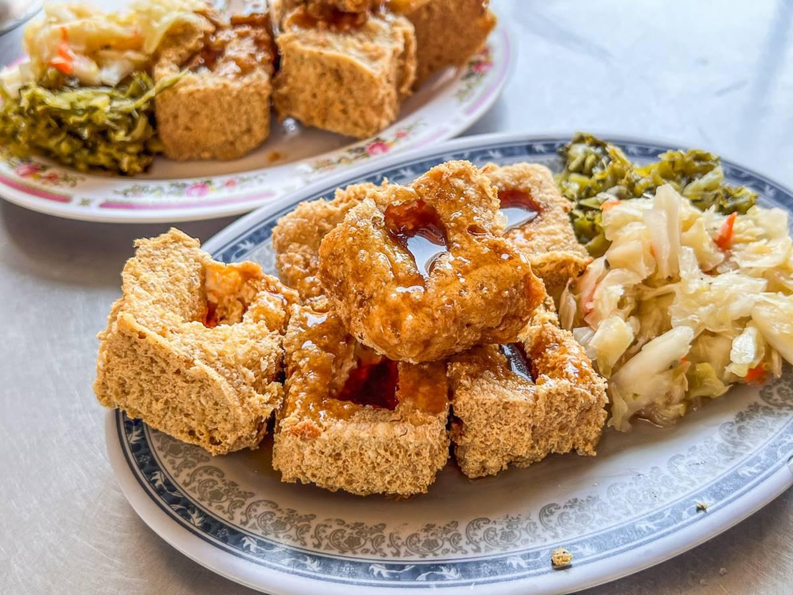

台湾臭豆腐源于大陆，1949年由湖南籍老兵李名传将其带往台湾省，后经台湾人的不断改良，逐渐形成今天的台湾臭豆腐。

与长沙臭豆腐、绍兴臭豆腐不同，台湾臭豆腐通常使用厚实且柔软含水的豆腐块，在发酵的臭卤水中浸泡后油炸，咬开后内部通常仍然鲜嫩且呈白色，配料则通常为泡菜+蒜蓉/酱油膏/辣椒酱。

# 餐品注释15：猪肉味噌汤纳豆套餐

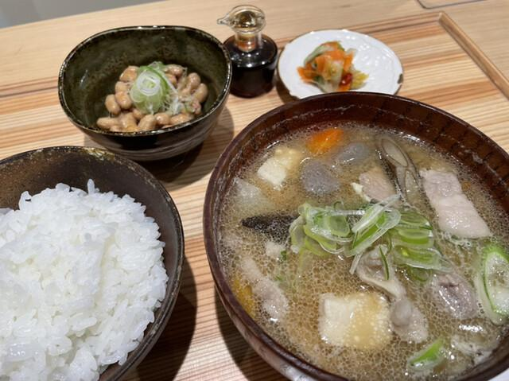

「とん汁納豆定食」（猪肉味噌汤+纳豆套餐），其中的猪肉味噌汤，是日本很常见的一种味噌汤，以猪肉和各种蔬菜（通常包含萝卜、胡萝卜、牛蒡、魔芋、洋葱等）为主要材料，并在此基础上明确加入一份纳豆。属于非常典型的日本家庭式、平价定食组合，是相当传统的早餐/简餐搭配。

# 餐品注释16：猪排咖喱饭

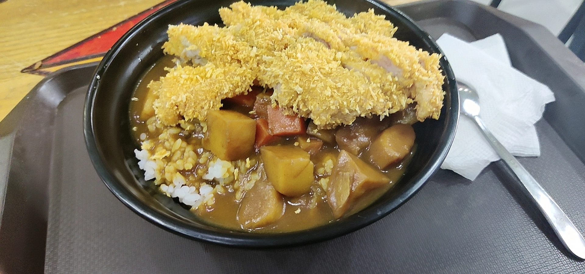

「カツカレー」（猪排咖喱饭），顾名思义，就是最常见的炸猪排咖喱饭。

图片是译者在国内就读大学时，在学校门口的店里拍摄的。

# 餐品注释17：混合烤肉套餐

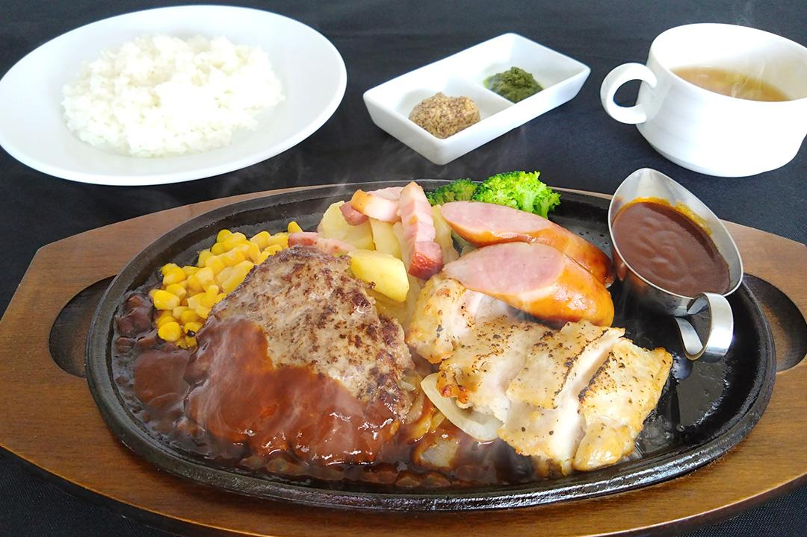

「ミックスグリル定食」（混合烤肉套餐），通常是日本洋食店、家庭餐厅里的一种套餐。通过把几种不同的肉类一起煎、烤或铁板烧，组合起来作为一份主菜。主菜通常包括牛排、汉堡肉、烤鸡肉、香肠，有时还会有培根、猪排等。

# 餐品注释18：生鸡蛋拌饭套餐

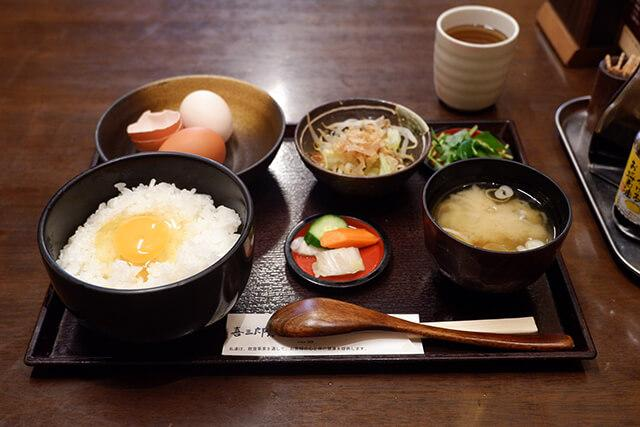

「たまごかけごはん定食」（生鸡蛋拌饭套餐），就是以生鸡蛋拌饭为主食的套餐。

做法非常简单：盛一碗热米饭、打入一个生鸡蛋、加一点酱油、搅拌均匀后就可以直接吃了。有些店铺还会提供多个鸡蛋，或者提供酱油、葱、鲣鱼碎等不同配料。

# 餐品注释19：年糕小豆汤

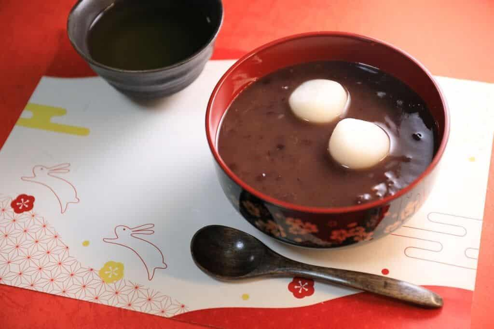

「おしるこ（お汁粉）」（年糕小豆汤），是一种日本传统的汤羹，把红豆煮熟后，加入白砂糖调制而成，有时会放入年糕一起煮。考虑到死后世界的食品用料充足程度，年糕应该是没少放。

# 餐品注释20：BLT三明治

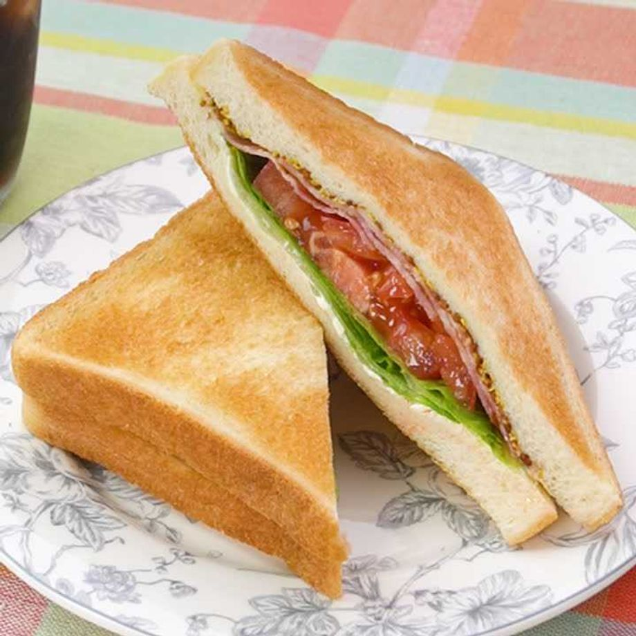

「ＢＬＴサンドイッチ」（BLT三明治），是经典的日本人瞎简写命名法。

B = Bacon = 培根

L = Lettuce → 生菜

T = Tomato → 番茄

说白了就是「培根生菜番茄三明治」。通常还会涂一点蛋黄酱。

# 餐品注释21：赤福

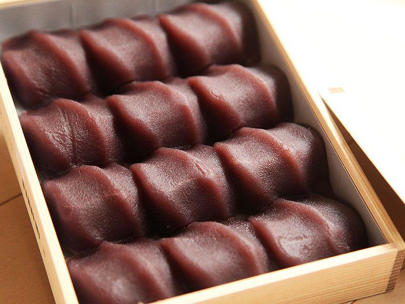

「赤福」是日本三重县伊势市最有代表性的传统日式点心之一。它和伊势神宫参拜文化的关系非常紧密，可以说是“去伊势旅游时几乎绕不开的名物”。

这种点心和普通豆沙包的原材料类似，由柔软的糯米年糕+大量细腻的红豆沙组成，但却把红豆沙包裹在年糕的外面，且豆沙往往被做成三道波纹沟的形状。据说这种形状代表着伊势神宫周边五十铃川的流水，而白色的糯米年糕代表着河床上的小石子。

赤福的出现时间通常被认为是1707年（宝永4年），当时伊势参拜非常兴盛，参宫道路沿线出现了大量卖年糕的茶屋。这种点心一方面制作方便，另一方面能够给长途参拜的旅人补充体力，所以逐渐形成了著名的“年糕街道”文化。赤福也是在这样的背景下发展起来的。

「赤福」这个名字也有来历，据说来自：赤心慶福（せきしんけいふく），可以理解为“怀着像婴儿一样纯真的真心，为自己和他人的幸福感到高兴”。据说这是店铺创业初期一位来自京都的茶道宗匠对其点心的赞语，创业者从「赤心慶福」中取了「赤福」二字作为名称。

# 餐品注释22：正宗日本版英式松饼

正宗的日本版英式松饼（イングリッシュマフィン），和中国的蛋糕状的甜松饼和英国本土浇了枫糖的松饼不一样，更像是一种圆形、扁平、内部有孔洞的面包，外形很接近皖北的火食。

其表面通常会撒上玉米粉或类似颗粒，摸起来有点粗糙。通常从中间横向掰开或切开后烘烤，再夹黄油、鸡蛋、火腿、奶酪等。这种松饼皮在日本的麦当劳等地方也很常见，许多早餐汉堡经常用它来代替普通汉堡面包。

# 餐品注释23：牛排加汉堡排组合套餐

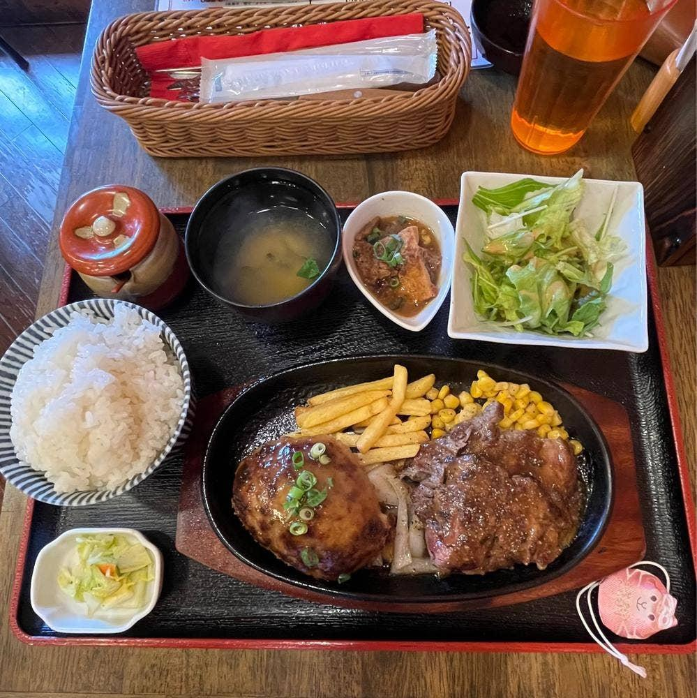

无需解释，看图即可。

# 歌曲注释1：《Wild Heaven》- TM NETWORK

TK的这句话源于TM NETWORK于1991年发布的单曲《Wild Heaven》，歌词的第一句就是“Just Wild Heaven!”

# 歌曲注释2：《Crazy For You》- TM NETWORK

TK的这句话源于TM NETWORK于1991年发布的专辑《EXPO》中的单曲《Crazy For You》。

这首歌时常大约7分钟，并没有以旋律歌唱为主，而是以电子舞曲为基础，由宇都宫隆扮演的男性与女性角色进行大量对白，对白内容则具有相当强烈的成人情色喜剧色彩。

歌曲本身所属的《EXPO》本身就是一个非常实验性的专辑。索尼音乐对对专辑概念的描述是：把每首歌都当成一个“展馆”，构成一个“音乐博览会”。因此里面的每首歌曲都具有相当独特的风格，而《Crazy For You》更是直接做成了一场“声音情境剧”

# 歌曲注释3：《HURRY UP!》- B'z

TK的这句话源于B'z的单曲《HURRY UP!》，这首歌首次收录于1989年发布的专辑《OFF THE LOCK》：
Hurry Up! 今なら間に合う（Hurry up! 现在还来得及）
Oh! 飛んでって 抱きしめてやれ（Oh! 飞奔去抱紧她吧）

# 歌曲注释4：《太陽のKomachi Angel》- B'z

TK的第二句话也源于B'z的单曲《太陽のKomachi Angel》
本気で Push! Push! We can say yeah yeah!（认真来场 Push! Push! We can say yeah yeah!）

# 歌曲注释5：快嘴约翰

「Scatman John」（快嘴约翰）是美国歌手 John Paul Larkin（1942–1999）的艺名。他最出名的就是1994年发行的歌曲 《Scatman (Ski-Ba-Bop-Ba-Dop-Bop)》。而“拟声唱法（scat）”则是指歌手不唱具有实际语义的歌词，而是用各种音节、拟声词来模仿乐器或构成旋律的唱法。

快嘴约翰的独特之处，在于其将原本主要属于爵士乐即兴演唱的scat与Eurodance/Dance-pop融合在了一起。其电子舞曲节拍+爵士式即兴无词吟唱的风格、在当时非常独特。

而 Scatman John 本人从小就患有严重的口吃，这使得他说话非常困难。但他发现自己在唱歌，尤其是进行 scat 演唱时，反而能够流畅地表达。scat对他来说某种程度上也是一种突破语言障碍的表达方式。

# 歌曲注释6：《目を閉じておいでよ》- BARBEE BOYS

音无的这句话源自于BARBEE BOYS（バービーボーイズ）的《目を閉じておいでよ》。这首歌是一首非常典型的“80年代末日本成人向流行摇滚”：性感、暧昧、带一点坏坏的挑逗感，而且最有特色的是男女双主唱之间的“互相撩拨”。

歌词的内容，大致是一个女人已经有恋人/对象，但又被另一个男人吸引的场景。男方诱惑女方暂时忘掉那个“温柔但没什么激情”的家伙，今晚尝试和自己在一起，带有一种非常明显的暧昧、诱惑甚至带点“别管那么多”的情色意味。

歌词中反复把两个男人进行比较——例如“脸不一样”“习惯不一样”“手指触碰的位置不一样”之类，实际上是在暗示：不要想原来的男人，来体验一下不一样的夜晚。

此外，BARBEE BOYS最大的特色之一就是 KONTA（男）＋杏子（女）的双主唱。KONTA的声音偏高、尖、带沙哑感，杏子的声音则明显更低沉、成熟，两个人放在一起形成非常特殊的反差。《目を閉じておいでよ》则恰好把这个特点发挥到了极致。

# 歌曲注释7：《愛のままにわがままに 僕は君だけを傷つけない》- B'z

音无所唱的这首歌，来源于B'z发行的第12张单曲《愛のままにわがままに 僕は君だけを傷つけない》，发行于1993年3月17日。累计销量超过200万张，长期以来都是B'z最具代表性的超级热门单曲之一。

这首歌的歌词本身充满了稻叶浩志代表性的末日式爱情宣言、性暗示双关等要素。此处的歌词翻译借鉴了【冷番填坑字幕组】的翻译版本。

这首歌同时也是日本テレビ电视台作为其40周年纪念，于1993年播出的《西游记》的片头曲。和《敢问路在何方》或《通天大道宽又阔》等其他经典的西游记主题曲相比，这首歌中并没有什么孙悟空、妖怪、旅途之类的要素，实际上是借用了歌曲本身那种「不管困难、认准目标、一路往前冲」的强烈气势。

此外，这首歌的“超长标题”本身也具有一定的代表意义。1993年前后的日本流行音乐，歌曲的标题通常还比较短，而这首歌却以超长的标题横空出世，这件事本身就在当时成为话题。甚至有资料将它视为后来日本音乐界出现大量“超长日文标题”风潮的先声之一。

# 棒球注释：读卖巨人队的球员们

这只队伍的四位NPC，都是麻枝准对日本职棒中央联盟中的【读卖巨人队（読売ジャイアンツ）】里知名选手的致敬。

第一棒：对应选手铃木尚广，该选手以极快的跑垒速度、盗垒/代跑能力闻名，长期效力于巨人。常常被视为“快腿球员”类型的代表。

第二棒：对应选手川相昌弘。他以出色的送垒短打（送りバント，又称“牺牲短打”，通过故意用短打把球碰出去，让已经上垒的跑者向前推进一垒，自己则通常会因此出局）能力闻名，其职业生涯中累计完成过533次送垒短打，是非常著名的“バント職人”。

第三棒：对应选手山仓和博。是日本职业棒球史上很有代表性的捕手位选手，也曾经担任过巨人队的三番打者。

第四棒：对应选手村田修一。其主要守备位置就是三垒，职业生涯也长期担任中心打线的第四棒，以强大的长打、本垒打能力著称。