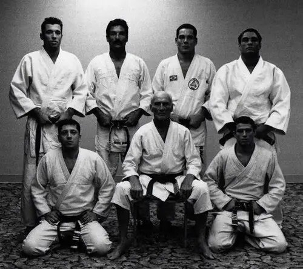
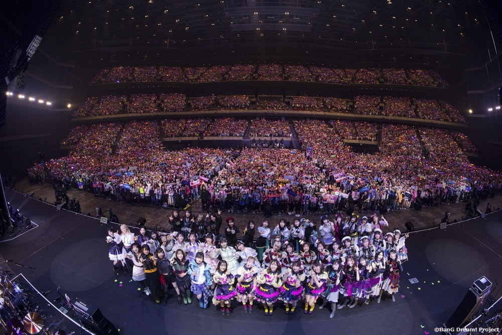
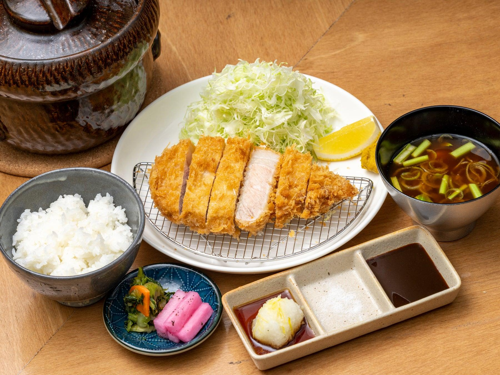
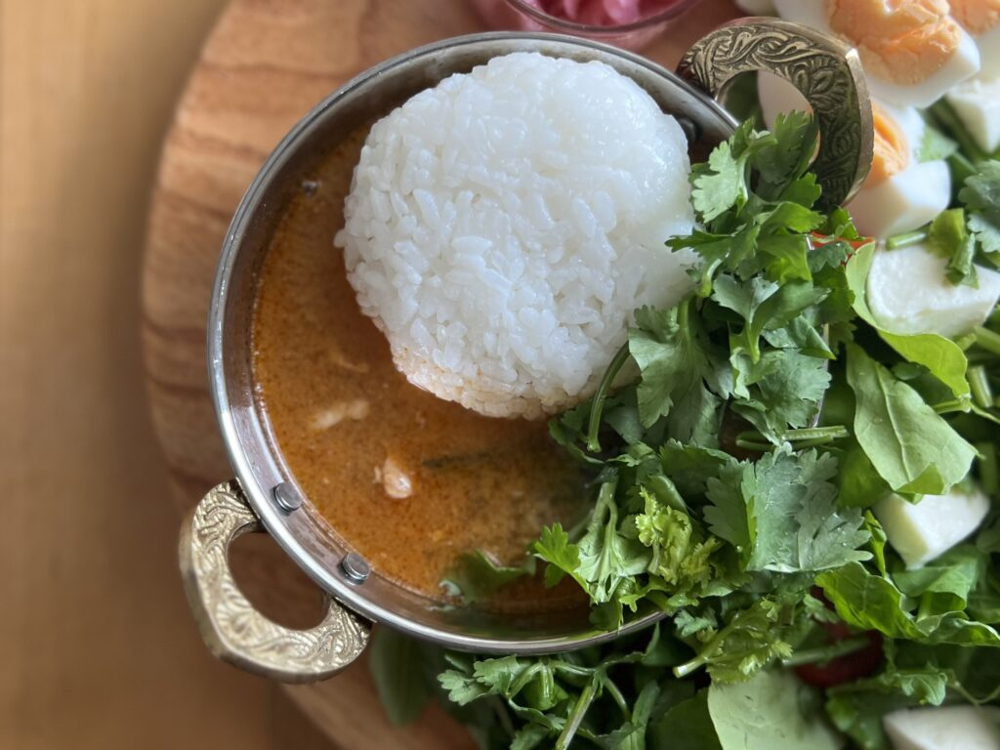
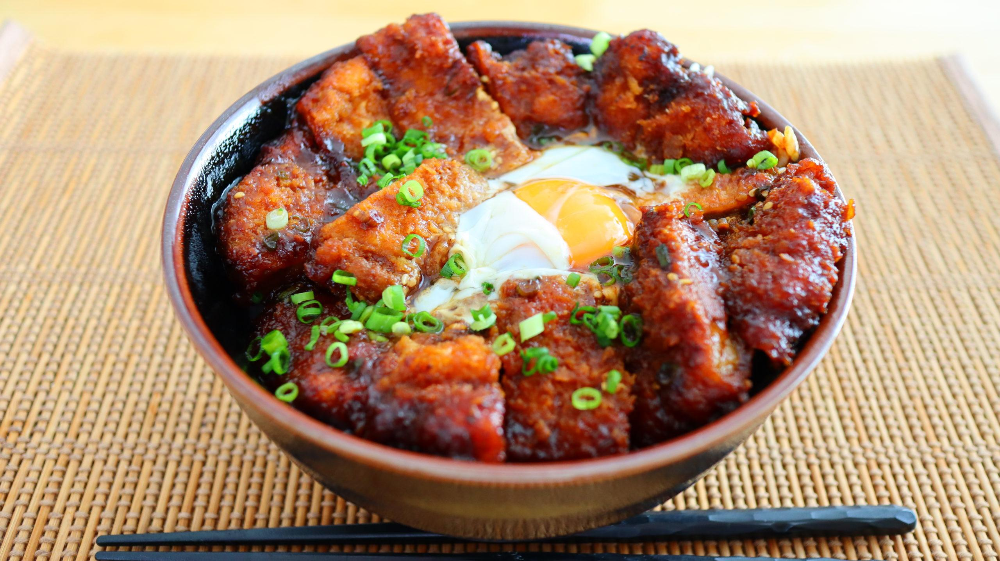
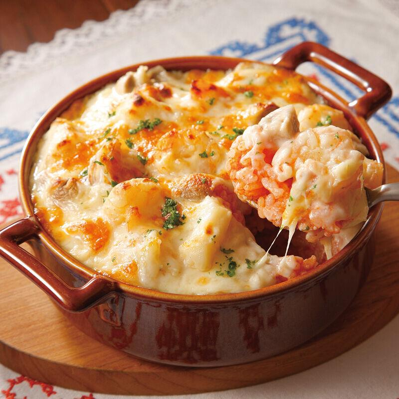

# 注释1：格雷西家族

格雷西家族是源于巴西的格斗家族，以创立巴西柔术（又称格雷西柔术）著称 。
格雷西家族通过参与无限制格斗赛事改良技术，并借助UFC赛事推广柔术。家族成员曾通过“格雷西挑战”与不同背景的选手进行无限制格斗并获胜，以此建立声誉。

20世纪初，日本柔术家前田光世在巴西进行柔术演示和表演赛，推动了该运动在巴西的普及，他定居贝伦并教授柔术。前田光世的师傅是日本现代柔道创始人嘉纳治五郎。卡洛斯·格雷西是前田光世的学生之一，后与其弟海利奥·格雷西改良技术。海利奥·格雷西身体瘦弱，但在钻研中发展了许多以小胜大的技术，完成了从“日本柔术”到“巴西柔术”的演化。

然而，现在提到这个词，很多日本人的第一反应不是巴西柔术本身，而是“这个家族人数特别多、个个都很能打、并且名字很难分得清”的刻板印象。在鼎盛时期，日本媒体当年经常报道：「またグレイシーか（怎么又是格雷西家的人）」，逐渐形成了“格雷西一族 = 人多得离谱的武术名门”的刻板印象。

# 注释2：ARENA

在日本，「アリーナ（Arena）」一般属于中大型演唱会场地，通常仅次于ドーム（巨蛋）和スタジアム（体育场）。

例如：

横浜アリーナ：约12,000～17,000人（根据舞台布置变化）
有明アリーナ：约10,000～15,000人
Kアリーナ横浜：约20,000人（日本目前最大的音乐专用Arena之一，《BanG Dream!》企划10周年LIVE「In the name of BanG Dream!」的举办地，图中展示的场地即为本次LIVE的全景图）

# 餐品注释1：炸猪排套餐

「トンカツ定食」（炸猪排套餐）是日本最经典的套餐之一，也是许多专门店（とんかつ屋）的招牌菜。一份标准的トンカツ定食通常包括：作为主菜的炸猪排、白米饭、味噌汤、高丽菜丝、腌菜，有时还会有少量土豆沙拉、小菜等。

猪肉通常是猪里脊或猪腰内肉，裹上面粉、蛋液、面包糠并油炸至金黄色。吃的时候通常蘸猪排酱、芥末、芝麻等。

# 餐品注释2：冬阴功咖喱

「トムヤムカレー」（Tom Yum Curry，冬阴功咖喱）是一种将泰国冬阴功（Tom Yum）和咖喱结合起来的融合料理。它并不是泰国传统菜，而是在日本比较常见的一种创意咖喱（創作カレー）。通常会以咖喱饭的形式出现，包含：米饭、偏稀的咖喱酱、鸡肉、虾、蘑菇等配料。本作中的做法中还加入了大量的香菜。与普通日式咖喱相比，它具有明显的冬阴功风味。吃起来通常会有酸辣、香料感很强、比日式咖喱清爽、带有东南亚风味等感觉。

尽管本作中的冬阴功咖喱采用的是正宗泰国做法，但现实中的日本人看到「トムヤムカレー」时，通常会理解为「具有冬阴功风味的咖喱（冬阴功咖喱饭）」，而不是一种历史悠久、固定做法的传统泰国料理。不同店家的配方差异可能很大，有的更接近冬阴功汤，有的则更像日式咖喱，只是加入了冬阴功的香料和酸辣风味。

# 餐品注释3：味噌猪排盖饭

「味噌カツ丼」（味噌猪排盖饭）是日本中部地区，尤其是爱知县名古屋最具代表性的盖饭之一。和普通炸猪排盖饭的区别在于其特有的的名古屋风赤味噌酱汁，且不会用鸡蛋炖煮。

其中的味噌用的不是一般白味噌，而是八丁味噌（はっちょうみそ）或类似的赤味噌（红味噌）。这种味噌咸鲜味很浓，且发酵香气明显，常加入糖、味醂、酒熬成酱，因此整体呈现咸甜浓郁的风味，颜色接近巧克力酱或黑糖浆的深红褐颜色。

# 餐品注释4：焗饭

「ドリア」（芝士焗饭）是日式西餐的一种。通常以米饭为底，中间加上鸡肉、海鲜、蘑菇等配料，浇上酱汁（最常见是奶油白酱）并铺满芝士，放进烤箱烤至表面金黄。最终呈现出表面焦黄且带有拉丝芝士、中间浓郁顺滑的口感。

虽然名字很像意大利菜，但ドリア实际上是在日本诞生的洋食。相传20世纪初，日本横滨一家西餐厅的主厨为客人创作了这道菜：将米饭、奶油白酱和奶酪一起焗烤，后来逐渐流行全国。因此，虽然名字源于西方，且中国国内外卖餐厅也经常出现这道菜，但ドリア在欧美并没有与之完全对应的传统菜肴。

# 歌曲注释1：《HURRY UP!》- B'z

TK的这句话源于B'z的单曲《HURRY UP!》：
Hurry Up! 今なら間に合う（Hurry up! 现在还来得及）
Oh! 飛んでって 抱きしめてやれ（Oh! 飞奔去抱紧她吧）

# 歌曲注释2：《太陽のKomachi Angel》- B'z

TK的第二句话也源于B'z的单曲《太陽のKomachi Angel》
本気で Push! Push! We can say yeah yeah!（认真来场 Push! Push! We can say yeah yeah!）
